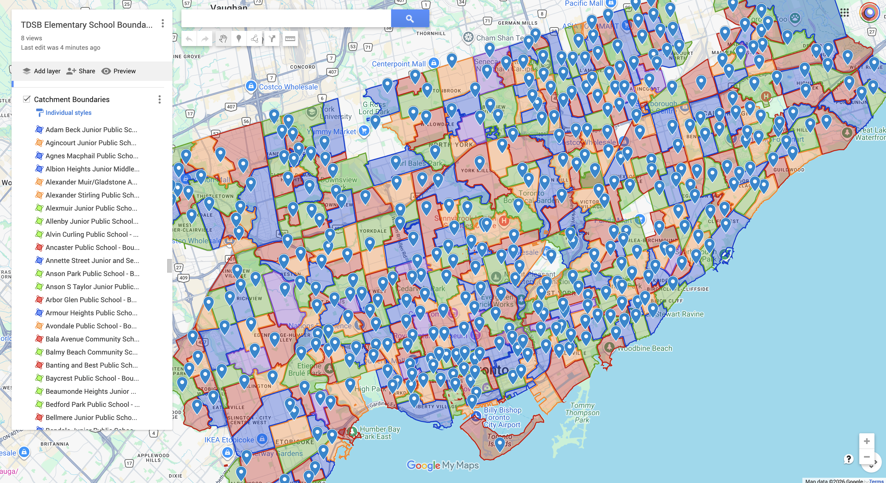

# TDSB Junior School Map

Scrapes the Toronto District School Board website for all elementary schools and
produces a KML file ready to import into [Google My Maps](https://mymaps.google.com).

Each school page (e.g. [Blake Street Junior Public School](https://www.tdsb.on.ca/Find-your/School/By-Map/focusonschool/5287))
contains an embedded Google Map with a pin and a catchment boundary polygon.
This script collects both for every eligible school.

[](https://www.google.com/maps/d/edit?mid=1boxjGJGOM8F99JkNFklqR4V-AeyGLxQ&usp=sharing)

[View the live map](https://www.google.com/maps/d/edit?mid=1boxjGJGOM8F99JkNFklqR4V-AeyGLxQ&usp=sharing)

## Output

`tdsb_junior_schools.kml` — two layers:

- **Schools** — a pin per school with name, address, phone, and grade range
- **Catchment Boundaries** — the attendance area polygon(s) for each school, coloured so no two neighbouring regions share the same colour (greedy graph colouring via shapely adjacency detection)

~400 schools are included; ~25 alternative/special schools have no catchment boundary on the TDSB site and are included as pins only.

## Usage

```bash
pip install httpx shapely
python3 scrape.py
```

Then import `tdsb_junior_schools.kml` into Google My Maps: **Create a new map → Import**.

## School selection

Included schools must have `Elementary` in their TDSB panel and a grade range
starting from JK, SK, or Grade UG (ungraded pre-JK programs). This captures all
schools serving primary/junior grades regardless of whether "Junior" appears in
the school name.

## Caching

On first run the script fetches the school list from the TDSB API and saves it
as `schools.xml`. Subsequent runs use this cache automatically. Delete it to
re-fetch fresh data.

---------------------------------------

_This project was 100% vibe coded with Claude Code. Level 💛¹_
